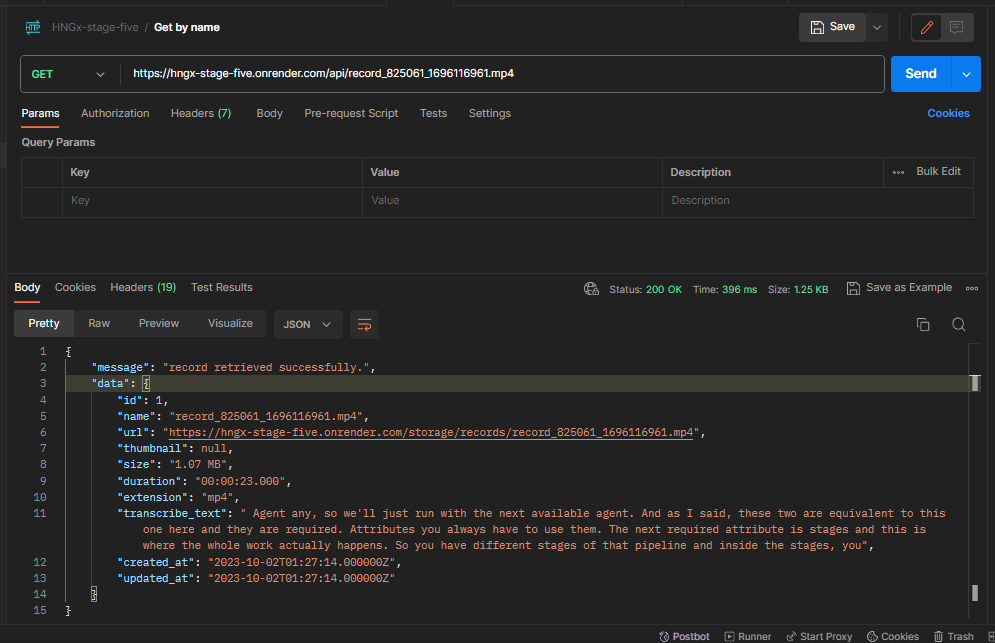
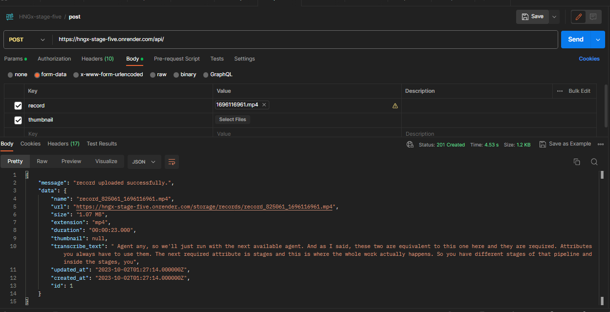

### API Endpoints

### Request and Response Formats
The API uses JSON for both requests and responses. The following table describes the JSON format for the requests and responses:

<table>
    <thead>
        <th> Requests </th>
        <th> Response </th>
    </thead>
    <tbody>
        <tr>
            <td>POST /api</td>
            <td>201 Create with the newly uploaded screen record in the response body</td>
        </tr>
        <tr>
            <td>GET /api/{name}</td>
            <td>200 OK retuns the record with the specified name in the response body.</td>
        </tr>
           <tr>
            <td>GET /api</td>
            <td>200 OK with an array of records in the response body.</td>
        </tr>
            <tr>
            <td>DELETE /api/{id}</td>
            <td>204 No Content</td>
        </tr>
    </tbody>
</table>

### Sample Usage

## Adding a screen record  (201 Created)

## Fetch a screen record (200 OK)

## Remove a record (204 No Content)

## Fetch users (200 OK)

